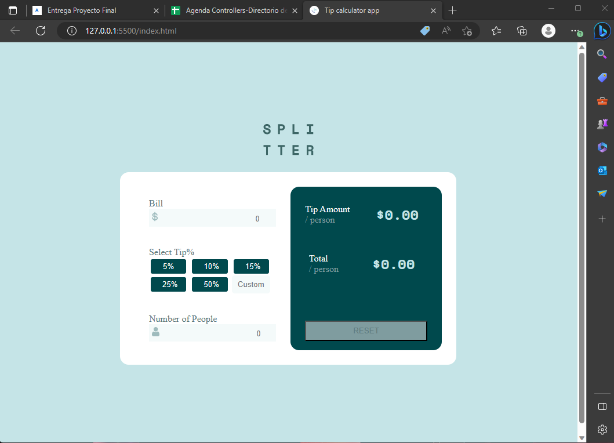
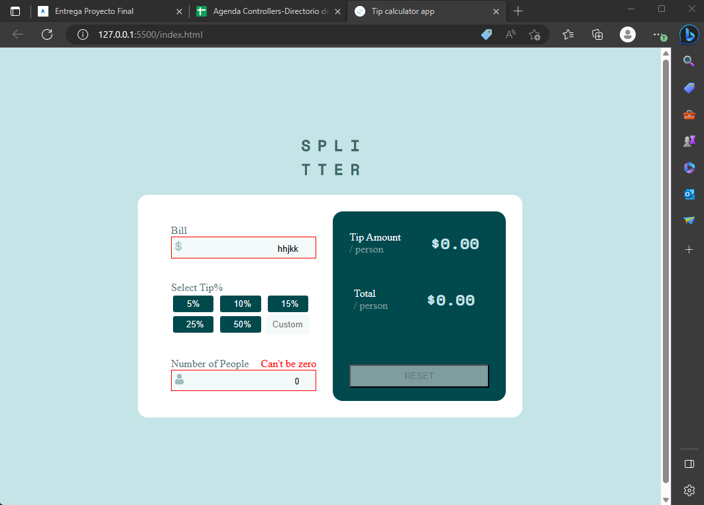
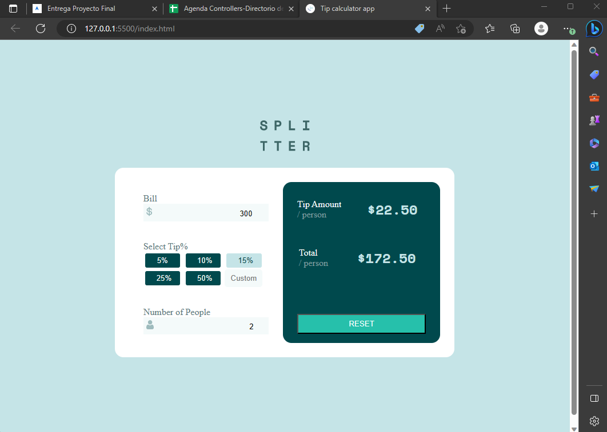

# funval-splitter

## About

This app helps you calculate the totals of an account and total tip divided by the number of people as the case may be.

Below, we showcase screenshots of the app.

<p align="center">
    
</p>
<p align="center">
    
</p>
<p align="center">
    
</p>
<p align="center">
    
</p>

## Built With

- HTML, CSS, JavaScript;
- VisualStudio Code, Git, & GitHub;

## Pre-requisites

- Visual Studio Code
- Git

## Live Demo

Live demo for this project can be found if you [click here](https://herokudev.github.io/funval-splitter/).

## Getting Started

To run this project, you only need a computer with internet connection and a browser installed, and follow these steps:


1. In your terminal, in the folder of your preference, type the following bash command to clone this repository:

```sh
git https://github.com/herokudev/funval-splitter.git
```

2. Now that you have already cloned the repo run the following commands to get the project up and running:
```sh
cd funval-splitter
```
In the browser of your choice you must open the file: "index.html".

## Author

👤 **Herbert Orellana**

- GitHub: [@herokudev](https://github.com/herokudev)
- Twitter: [@HerbertOrellan4](https://twitter.com/HerbertOrellan4)
- LinkedIn: [LinkedIn](https://www.linkedin.com/in/herbert-orellana/)


## 🤝 Contributing

Contributions, issues, and feature requests are welcome!

Feel free to check the [issues page](https://github.com/herokudev/funval-splitter/issues).

## Show your support

Give a ⭐️ if you like this project!

## 📝 License

This project is [MIT](./LICENSE) licensed.
